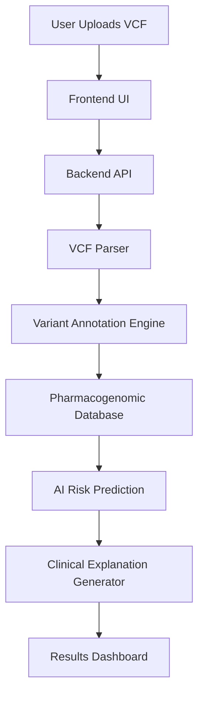

# 🧬 PharmaGenAI — AI-Powered Pharmacogenomic Risk Analysis


PharmaGenAI is an AI-driven pharmacogenomics web application that analyzes patient genetic data (VCF files) and predicts personalized drug response risks with clinical interpretation.

It enables precision medicine by linking genetic variants with drug metabolism and providing actionable therapeutic insights.

---

## 🔗 Live Links

🌐 Live Demo → https://pharmagenai.vercel.app  
📦 GitHub Repo → https://github.com/dhairyagupta07/pharmagene  

---

## 🚀 Key Features

- Genetic variant analysis from VCF files  
- Drug-gene interaction prediction  
- Personalized risk classification  
- AI-generated clinical interpretation  
- Decision support for dosage and therapy  
- Interactive web interface  

---

## 🏗 System Architecture



---

## 🔄 Application Workflow

1. User uploads genetic variant file (VCF)
2. Drug name is provided
3. Variants mapped to pharmacogenomic markers
4. Drug-gene interaction evaluated
5. AI model generates interpretation
6. Risk and recommendations displayed

---

## 🧰 Tech Stack

### Frontend
- React
- Vite
- JavaScript
- CSS

### Backend
- Node.js
- REST API

### Genomic Processing
- VCF parsing
- Variant annotation
- Gene mapping

### AI Layer
- Risk classification engine
- Clinical explanation generator

### Deployment
- Vercel

---

## 📂 Project Structure

```
pharmagene/
│
├── public/
├── src/
│   ├── components/
│   ├── pages/
│   ├── services/
│   └── utils/
│
├── backend/
│   ├── api/
│   ├── genomic-engine/
│   └── ai-module/
│
├── screenshots/
├── package.json
└── README.md
```

---

## ⚙ Installation

### Clone repository
```bash
git clone https://github.com/dhairyagupta07/pharmagene.git
cd pharmagene
```

### Install dependencies
```bash
npm install
```

### Setup environment variables
```bash
cp .env.example .env
```

### Run development server
```bash
npm run dev
```

App runs at:

```
http://localhost:5173
```

---

## 🐳 Docker Setup (Optional)

### Build image
```bash
docker build -t pharmagene .
```

### Run container
```bash
docker run -p 3000:3000 pharmagene
```

---

## 📡 API Documentation

### Base URL
```
/api
```

---

### Analyze Genetic Risk

POST `/api/analyze`

Request:
```json
{
  "vcf_file": "<file>",
  "drug_name": "warfarin"
}
```

Response:
```json
{
  "risk_level": "High",
  "affected_genes": ["CYP2C9", "VKORC1"],
  "clinical_summary": "Reduced metabolism detected",
  "recommendation": "Consider dose reduction"
}
```

---

### Generate Clinical Explanation

POST `/api/explain`

Response:
```json
{
  "explanation": "Genotype indicates altered metabolism..."
}
```

---

## 🧪 Usage Examples

### Clinical Decision Support
- Identify drug sensitivity
- Adjust dosage
- Prevent adverse drug reactions

### Precision Medicine
- Personalized therapy planning
- Genotype-guided prescriptions

### Research
- Variant-drug association studies
- Population pharmacogenomics

---

## 🚀 Deployment

### Deploy frontend to Vercel

```bash
npm run build
vercel deploy
```

---

## 🤝 Contributing

1. Fork repository
2. Create feature branch
3. Commit changes
4. Push to branch
5. Open pull request

---

## 👨‍💻 Team Members

- Dhairya Gupta  
- Kavya Gandhi  
- Deyaan Kapasi  

---

## 📌 Future Enhancements

- Multi-drug interaction modeling
- Expanded genomic database
- Clinical guideline integration
- EHR integration
- Real-time annotation APIs

---

## 📄 License

This project is intended for academic and research use.

---

## ⭐ Support

If you like this project, please star the repository ⭐
